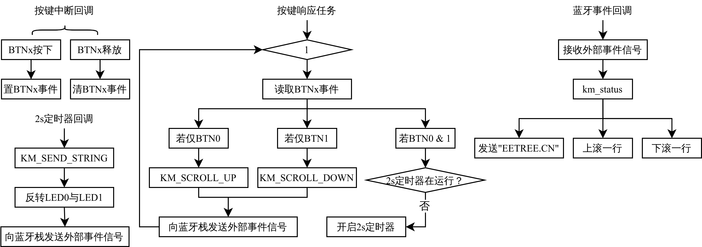

# XG24 BLE HID Key Mouse

基于 Silicon Labs XG24-EK2703A 开发板，通过 HID 协议实现了一个蓝牙家盘+鼠标复合设备，可通过按键实现上下翻页、发送字符功能。使用板载两个按键，当BTN0按下，向上翻页；当BTN1按下，向下翻页；当两按键同时按下2s后，向主机依次发送字符“EETREE.CN”。

# 📦 Prerequisites

开发环境：[Simplicity Studio 5](https://www.silabs.com/developers/simplicity-studio)，Gecko SDK 4.4.0，GNU ARM toolchain 12.2。

若要基于 VSCode 与 Simplicity Studio for VS Code 插件开发，请在 Simplicity Studio 创建新项目时设置。

# 🛠️ Setup

1. 为 XG24-EK2703A 开发板新建一个“Bluetooth - Soc Empty”的空白示例
2. 将 `app.c`、`app.h` 复制到项目中
3. 导入 GATT 配置：
   1. 打开项目中 `.slcp` 文件
   2. 在 CONFIGURATION TOOLS 选项卡下找到 Bluetooth GATT Configurator
   3. 导入 `config/btconf/gatt_configuration.btconf` 文件
   4. 保存 GATT 配置
4. 打开 `.slcp` 文件，在 SOFTWARE COMPONENTS 选项卡下安装如下组件：
   - [Platform] → [Driver] → [Button] → [Simple Button]，例化 btn0 与 btn1，对应开发板上两个按键
   - [Platform] → [Driver] → [LED] → [Simple LED]，例化 led0 与 led1，对应开发板上两个 LED
   - [Services] → [IO Stream] → [IO Stream: USART]，保持默认配置即可
   - [Application] → [Utility] → [Timer for FreeRTOS]
   - [Application] → [Utility] → [Log]
5. 构建项目
6. 参考工程及蓝牙GATT配置：[Bluetooth - HID Keyboard 示例](https://github.com/SiliconLabs/bluetooth_applications/tree/master/bluetooth_hid_keyboard#setup)

# 📜 Documentation

## ⛓️ Workflow

## 📽️ More details

1. 项目详细说明，[CSDN：基于XG24-EK2703A的BLE HID蓝牙键盘+鼠标复合设备功能开发(BLE+HID+FreeRTOS+Gecko SDK)](https://blog.csdn.net/weixin_46422143/article/details/135655630)
2. 项目功能演示，[B站：基于XG24-EK2703A的BLE HID蓝牙键盘+鼠标复合设备功能开发](https://www.bilibili.com/video/BV1RV411X7z8/)
